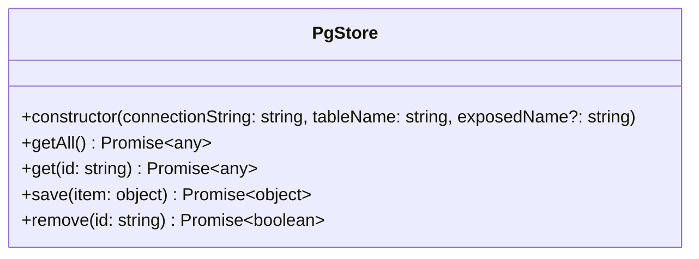

# electronade-pgstore-util

It's a package that provides some utilities for [electronade-pgstore](https://electronade-pgstore.netlify.app/).

It's an optional module for `electronade-pgstore` so `electronade-pgstore` should be installed before using `electronade-pgstore-util`.


[](https://www.npmjs.com/package/electronade-pgstore-util)

## Installation
``` shell
npm install electronade-pgstore-util
```

## Interfaces



``` typescript
class PgStore {
  constructor(
    connectionString: string,
    tableName: string,
    exposedName?: string
  );
  public getAll() => Promise<any>;
  public get(id: string) => Promise<any>;
  public save(item: object) => Promise<object>;
  public remove(id: string) => Promise<boolean>;
}
```

## Usage

import and use PgStore class in Renderer process.

``` typescript
import { PgStore } from "electronade-pgstore-util";

const store = new PgStore(
  "postgres://...",
  "tableName"
);

const item = await store.save({ name: "test" });

console.log(item); // { _id: "xxx", name: "test" }

console.log(
  await store.get(item.id)
); // { _id: "xxx", name: "test" }


console.log(
  await store.getAll()
); // [{ _id: "xxx", name: "test" }]

console.log(
  await store.remove(item._id)
); // true
```
